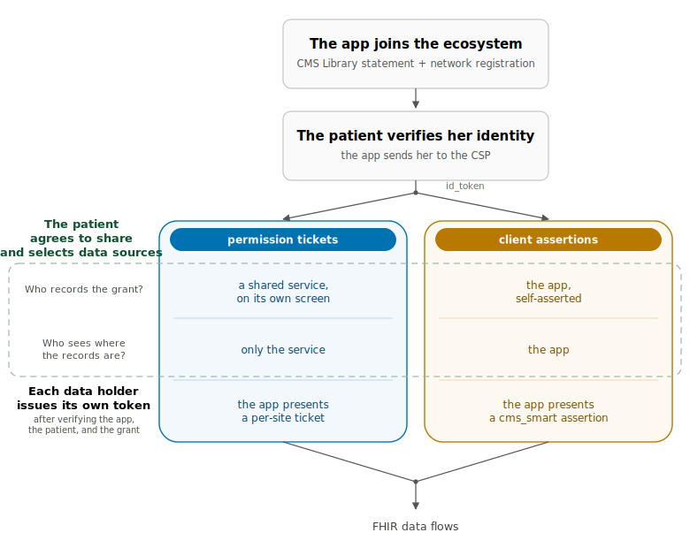
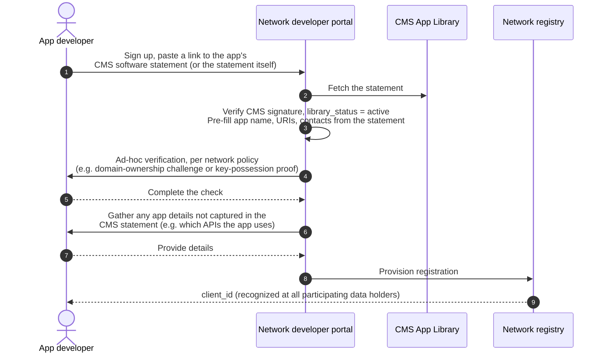
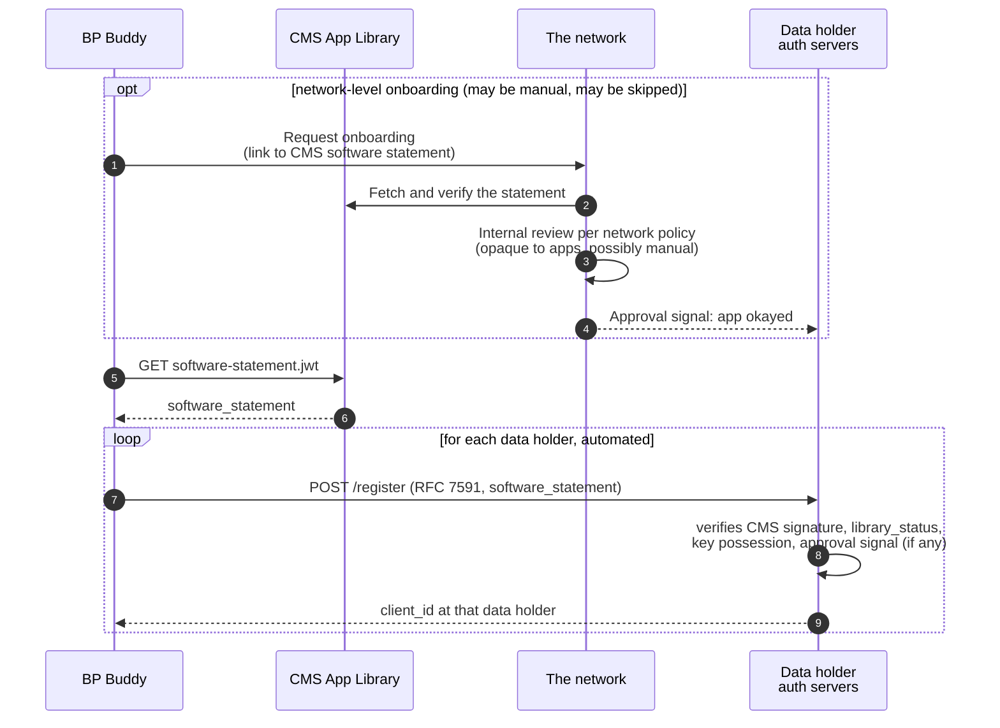
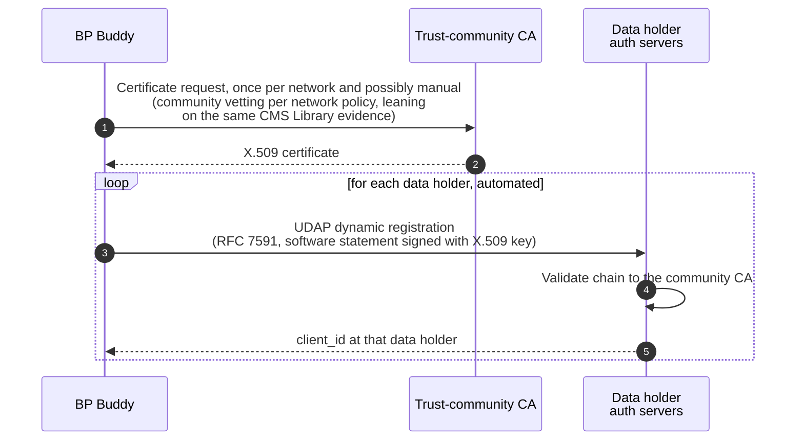
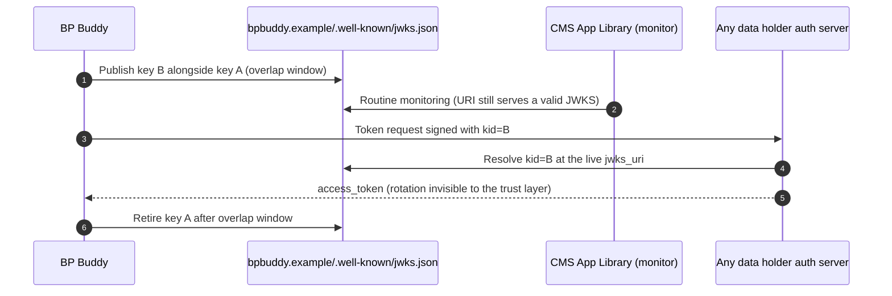
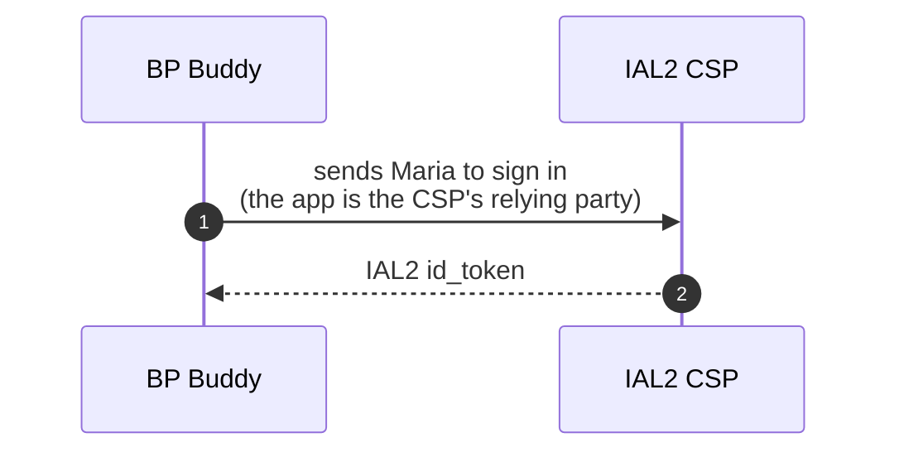
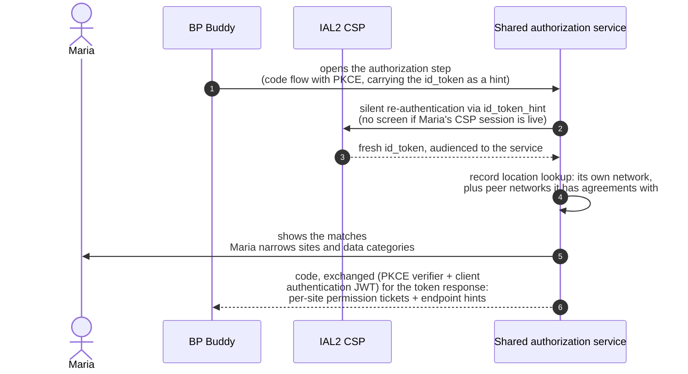
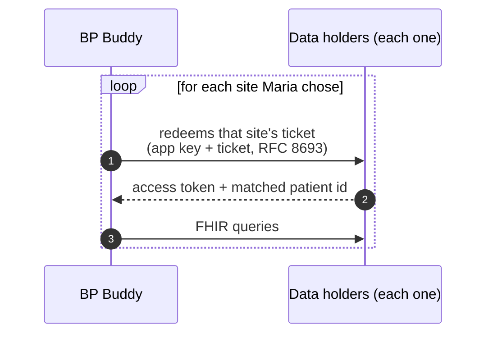
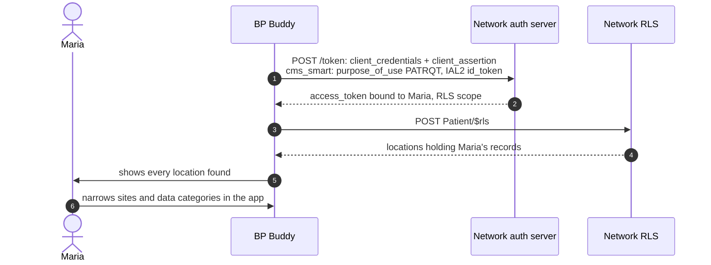
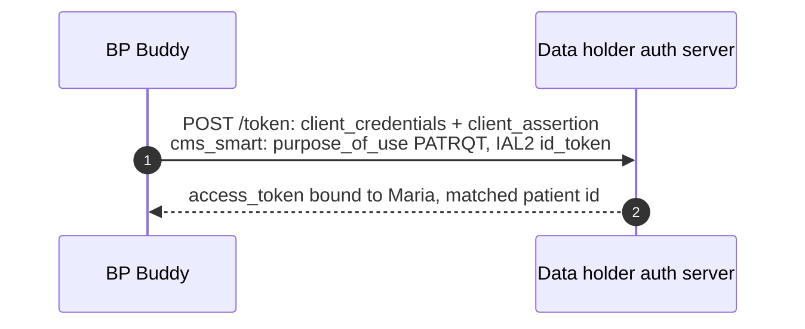

# How Patient Apps Use a CMS-Aligned Network for Record Location and Data Access

*This proposal shows how a patient-facing app, listed in the Medicare App Library, uses a CMS-Aligned Network to find where a patient's records are and to fetch them. Every flow in it ends the same way: each data holder, knowing the app and its key, knowing the patient's identity was verified at IAL2, and knowing what she authorized, issues its own access token with the matched patient id. What varies is how those facts reach the data holder.*

The proposal shows one full flow, then three places where a deployment can do things differently. No version requires a [home network](apps-without-home-networks.md), and every version keeps token issuance at the data holder.

---

## Cast

| Actor | Role |
|---|---|
| **BP Buddy** | Patient-facing app, listed in the Medicare App Library and registered with the networks it uses (see How the app joins the ecosystem). |
| **Maria** | A patient with records at several organizations, identity-proofed once at an IAL2 CSP. |
| **IAL2 CSP** | A Kantara-certified IAL2 credential service provider (today CLEAR and ID.me). Verification may draw on evidence like a state-issued mobile driver's license, but the Kantara IAL2 certification is the bar. |
| **CMS App Library** | Lists vetted patient-facing apps and publishes a signed software statement for each. The statement is the app's identity everywhere in this proposal. |
| **The network** | A CMS-Aligned Network: shared rules and trust agreements binding its participating data holders, plus a record location service, a published onboarding procedure for applications, and potentially shared authorization services. |
| **Data holders** | Each runs its own authorization server and FHIR endpoint, and issues its own access tokens. |

---

## What has to happen

Before a data holder releases anything, it has to know the app, know the patient's identity was verified at IAL2, and know what the patient authorized, and someone has to work out where the patient's records are. There are two ways to do the last three steps: with network-based permission tickets (blue) or with app-based client assertions (orange). The table near the end compares them.

The app joins once per network, before any patient is involved; the next section covers how. Everything after that happens per patient.

---

## How the app joins the ecosystem

Getting into the Medicare App Library involves identity verification, conformance testing against an open reference kit, certification by a recognized body, and a check that the app controls its `jwks_uri`. From then on, CMS publishes a signed software statement for every active Library app: a short-lived JWT naming the app, its URIs, and its `jwks_uri`, and asserting its Library status ([example](example-artifacts/software-statement.md)). The statement pins the app's display name under the CMS signature, and it binds the app's keys by URL rather than by value, so the app rotates keys at its own `jwks_uri` without anyone re-issuing anything.

This proposal never puts an intermediary between the app and the parties it talks to. If we did pursue designs where a [home network](apps-without-home-networks.md) acts as one, we would need to develop protocols that accurately convey details about both the home network and the app throughout every flow, because the app is what patients recognize and what audit logs name. We avoid this complexity by modeling apps as direct participants in the ecosystem.

Once an app is listed in the Library, it can register with CMS-aligned networks. The app finds each network, its registration method, and its endpoints in the National Provider Directory. To count as CMS-aligned, a network must meet two functional requirements; how it meets them is up to the network, and the examples below show the range of mechanisms that qualify.

The first requirement is that the network must define a single mechanism through which an app can connect to every data holder in the network without doing work specific to any individual data holder. Manual steps are acceptable once per network, but never per data holder. This is what lets registration scale: however a network runs its front door, the layer behind it is automatic, so adding a data holder creates no new work for apps, and registering takes a bounded amount of work per network rather than per organization.

The second requirement is that the mechanism must not add to an app's cost of participating in individual access; if it involves certificates or other credentials, the network ensures apps can obtain them without paying. Registration ends with the app holding a client_id that the network's data holders recognize, and with each of them able to resolve the app's keys from its `jwks_uri`.

Three patterns cover the methods networks are likely to document. They are examples rather than a closed list: a network can document something else, so long as it meets the same two requirements.

### Once per network, through a developer portal

A human registers once for the whole network. The portal pre-fills its form from the CMS statement and verifies one signature instead of re-vetting the app; what its ad-hoc verification looks like is the network's business, and the spec should leave it unspecified. A network can also run this pattern with a different front door, forwarding dynamic registration requests from any of its data holders to the central registry and syncing the resulting client out to the rest. Onboarding can take time and involve several steps; for a point of reference, ONC's API Condition of Certification requires production registration within five business days. Since Library apps are always patient-facing, the set of APIs an app needs is the last manual input, and future work could automate even that.

*Example artifacts: [registration through a developer portal](example-artifacts/portal-registration.md).*

### At each data holder, presenting the CMS software statement

The app presents the CMS statement at each data holder's RFC 7591 registration endpoint, and a client library performs the calls in a loop, so the larger count costs nothing manual. The network may run its own onboarding first, with as much manual review as its policy requires, or skip that layer and let the CMS statement carry the decision; its data holders consult the approval signal automatically. The statement pins the app's display name and URIs under the CMS signature, which closes a gap in certificate schemes as published: there, `client_name` is self-asserted at registration, and servers are not required to validate it against the certificate or any directory.

*Example artifacts: [dynamic registration with the CMS statement](example-artifacts/dynamic-registration.md) and [the software statement itself](example-artifacts/software-statement.md).*

### At each data holder, presenting a community-issued certificate

The network's community CA issues the app a certificate, with vetting per the network's policy that can lean on the same CMS Library evidence, and UDAP dynamic registration proceeds at each data holder from there. Certificate processes are where costs most often creep in, so the second requirement above bears repeating: a network that chooses a CA-based flow makes sure that getting certificates adds nothing to an app's cost of participating in individual access. Issued certificates have to track the app's `jwks_uri` automatically (see Key rotation below).

*Example artifacts: [registration with a community-issued certificate](example-artifacts/certificate-registration.md).*

### Key rotation

The app's keys live at its `jwks_uri` and rotate there on the app's own schedule. The CMS statement binds the URL, not a key, so rotation needs no re-issuance anywhere: data holders resolve the app's current keys at token time by `kid`, and the app publishes a new key alongside the old for an overlap window, starts signing with the new `kid`, and retires the old one.

*Example artifacts: [key rotation, with the JWKS before and during the overlap window](example-artifacts/key-rotation.md).*

Credentials that a network or a trust community issues to the app (the certificate method above) have to track the `jwks_uri` automatically; if re-syncing means emailing someone, rotation has turned into a manual per-network step.

---

## Permission-ticket flow

This expands the figure's permission-ticket path. A shared authorization service captures the grant. The network trusts this service but does not have to operate it; it may be run by the network itself, by a portal vendor, or by another party under contract with the network or its participants. The service can look up record locations in its own network and in peer networks it has agreements with.

### Getting the id_token

*Example artifacts: [the CSP sign-in](example-artifacts/csp-sign-in.md).*

1. BP Buddy signs Maria in at her IAL2 CSP: the app is the CSP's relying party, and it holds the resulting id_token.

### Authorizing and locating records

*Example artifacts: [opening the authorization step](example-artifacts/authorization-step.md), [record location at a peer network](example-artifacts/peer-record-location.md), and [the token response carrying per-site tickets](example-artifacts/issuance-token-response.md).*

1. The app opens the authorization step at the shared authorization service (a standard SMART App Launch code flow with PKCE), already holding Maria's id_token, which it passes as a hint. The request also carries the app's Library-backed identity, so the service knows exactly which app is asking without any prior relationship.
2. The service performs OIDC authentication with the CSP, sending Maria's browser there with `prompt=none` and the app-provided id_token as the `id_token_hint`. The CSP can answer one of two ways: recognize its own session and silently issue a fresh id_token audienced to the service, or return an error meaning "ask again with prompts allowed," at which point the CSP runs whatever interactive checks it requires. How the CSP recognizes a returning user is its business, and there is never re-proofing.
3. The service looks up where Maria has records: its own network's data holders, plus peer networks it has agreements with. Record location happens before the app is issued any access token, so the service can show Maria the actual list of sites holding her records before anything is shared.
4. Maria sees the matches and narrows them: which sites, which data categories. Sites she leaves out are never disclosed to the app, either as hints or as tickets. Service-side selection is the only placement where "the app never learns I was ever there" is achievable.
5. Maria is redirected back to the app with a code, and the app exchanges it (PKCE verifier plus its client authentication JWT) for the token response, which carries one signed permission ticket per chosen site plus endpoint hints ([SMART Permission Tickets, proposal 003](https://build.fhir.org/ig/jmandel/smart-permission-tickets-wip/proposal-003-smart-launch-issuance.html)). Each ticket binds the grant: Maria's demographics, her identity evidence, the authorized scope, the site it is for, and the app's key.

A variant some services may accept: skipping the re-authentication and taking the app-passed id_token itself as the sign-in. That token is automatically verifiable and audience-bound to the app, and accepting it is the same trust model the client-assertion flow runs on. It is an honest option provided it is named for what it is: it proves the app holds a recent assertion about Maria, not that Maria is present in this browser. A service accepting it should say so rather than implying a separation it does not deliver.

### Tokens from each data holder

*Example artifacts: [redeeming a ticket through to FHIR retrieval](example-artifacts/permission-ticket.md).*

1. At each data holder, the app presents a client authentication JWT (signed with its key) and that site's ticket (RFC 8693 token exchange). The data holder verifies the ticket signature, independently verifies the identity evidence inside it, runs its own patient match, applies its own policy, and issues its own access token with the matched patient id.
2. FHIR queries proceed with each data holder's token. A still-valid ticket can be re-presented for a fresh token, and refresh tokens may be issued per site or by the network's issuing service ([proposal 004, continuation credentials](https://build.fhir.org/ig/jmandel/smart-permission-tickets-wip/branches/main/proposal-004-continuation-credentials.html)).

There is no `$rls` call by the app anywhere in this story: record location happened inside the authorization step, and the app received its answer as tickets.

## Client-assertion flow

This expands the orange path: the flow CMS documents for Blue Button, where the app attests the grant itself. `cms_smart` is the extension it uses ([Blue Button's CMS Aligned Networks flow](https://bluebutton.cms.gov/cms-aligned-networks-documentation/)): a `client_credentials` grant whose signed `client_assertion` carries a `purpose_of_use` (`PATRQT` for patient access) and the patient's IAL2 id_token. "What Maria authorized" rests on the app's own assertion, backed by Library vetting, and Maria never leaves the app. It is the baseline CMS has already documented. The separation at stake: a shared service recording the grant has no financial stake in the data flowing, while the app receiving the data does, and CMS's own position that a CSP should not learn sites of care draws the same kind of line between roles. Nothing mandates the separation; the matrix below is the accounting.

### Getting the id_token

*Example artifacts: [the CSP sign-in](example-artifacts/csp-sign-in.md).*

1. BP Buddy signs Maria in at her IAL2 CSP: the app is the CSP's relying party, and it holds the resulting id_token.

### Authorizing and locating records

*Example artifacts: [the client_credentials token and $rls call](example-artifacts/client-credentials-rls.md).*

1. The app gets a patient-bound token from the network's authorization server and calls `$rls`, which stands in for a record location operation whose wire shape is still an open question.
2. The app shows Maria every location found, and she narrows sites and data categories inside the app. She has the same controls over what data flows as in the permission-ticket flow, but two things differ around them. The app has already seen every care relationship (the behavioral health clinic, the reproductive health clinic) before she chooses. And the party capturing her choices is the same party receiving the data, with no record outside the app for anyone else to audit. (The disclosure is the same if a ticket-issuing service skips its own screen and returns everything: [a blanket ticket and the full hint list](example-artifacts/blanket-ticket.md).)

### Tokens from each data holder

*Example artifacts: [the cms_smart token request at a data holder](example-artifacts/cms-smart-data-holder.md).*

1. At each data holder, the app makes the same `cms_smart` call, and the data holder's verification work is nearly identical to the permission-ticket flow: client key against the Library-verified `jwks_uri`, identity evidence, its own patient match.

What shifts is the attestation of scope: a ticket carries what an independent party recorded Maria authorizing; the `cms_smart` call carries what the app asserts she authorized. Continued access here uses data-holder refresh tokens under the rolling 90-day window in the [CMS-Aligned Network spec](can-spec.md); the app needs a network access token only when it runs record location again, and once it knows the record holders it queries them without further intervention.

## Comparing the paths

Rows are criteria; the text in each cell describes what that path looks like from that criterion. The colors and marks are a first pass at scoring: ✓ favorable, ± mixed, ✗ unfavorable. The text should be uncontroversial; the scoring is the debatable part, and debating it is the point.

<table class="dm">
<thead><tr><th></th><th class="hb">permission tickets</th><th class="ho">client assertions</th></tr></thead>
<tbody>
<tr><th>Who records what Maria agreed to share</th><td class="g">a shared authorization service, on its own screen</td><td class="y">the app, in its own UI, backed by Library vetting</td></tr>
<tr><th>What the app learns about Maria's care sites</th><td class="g">the sites she chose; others are never named to it</td><td class="r">every match, before she narrows</td></tr>
<tr><th>Maria's steps at grant time</th><td class="y">one redirect; sign-in usually silent; one screen</td><td class="g">none beyond the CSP sign-in inside the app</td></tr>
<tr><th>What each data holder verifies</th><td class="g">the ticket signature, the identity evidence inside it, and its own patient match</td><td class="y">the app's key, the id_token, and its own patient match</td></tr>
<tr><th>Changes required at data holders</th><td class="y">accept RFC 8693 ticket redemption and verify tickets; token-exchange support is beginning to ship in major vendor communities, but most of the industry would still need to build it</td><td class="y">support the <code>cms_smart</code> extension on client_credentials grants; CMS documents it and Blue Button implements it, but no other production data holder offers it today</td></tr>
<tr><th>New parties that must exist</th><td class="r">a shared authorization service the network trusts</td><td class="g">none</td></tr>
<tr><th>How Maria revokes</th><td class="g">once, at the service; status reaches credentials derived from the ticket</td><td class="r">per app, and per data holder</td></tr>
<tr><th>What the audit trail holds</th><td class="g">the ticket itself: which app, which grant, signed</td><td class="y">the data holder's log of the app's call and its asserted purpose</td></tr>
<tr><th>How coverage grows</th><td class="g">the service adds peer networks; Maria's stops shrink toward one</td><td class="y">the app integrates each network's record location itself</td></tr>
</tbody>
</table>

