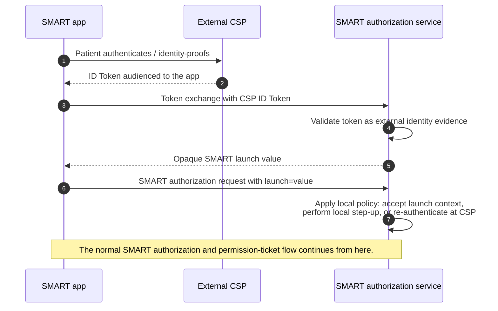

# External Identity Evidence Launch

*This profile defines a short back-channel prefix to a SMART authorization flow.*

A registered SMART app that already holds patient identity evidence from an approved external CSP can present that evidence to the SMART authorization service and receive an opaque SMART `launch` value. The app then starts the normal SMART authorization request with that `launch` value.

This gives the app a single start to the authorization code flow. The app does not need to know whether the authorization service will accept the launch context directly, perform local step-up, or send the patient back to the CSP for re-authentication. That choice belongs to the authorization service.

This avoids requiring the authorization service to send the patient back to the CSP solely to re-establish identity. CSP re-authentication is still available inside the downstream SMART authorization flow when the service chooses a fresh CSP ceremony with the authorization service as relying party.

In the record-location flow, this profile fits at the start of the shared authorization service step in [How Patient Apps Use a CMS-Aligned Network for Record Location and Data Access](authorizing-access.md#authorizing-and-locating-records). From the SMART authorization request forward, the flow proceeds normally; if the deployment uses SMART Permission Tickets, ticket issuance follows that profile.

## Flow



## Token Exchange

The app requests a SMART `launch` value using OAuth 2.0 Token Exchange at the authorization service's token endpoint.

The app authenticates as a registered SMART client. The request includes the client authentication mechanism established during registration, such as `private_key_jwt`.

| Parameter | Requirement | Description |
|---|---|---|
| `grant_type` | SHALL | `urn:ietf:params:oauth:grant-type:token-exchange` |
| `subject_token_type` | SHALL | `urn:ietf:params:oauth:token-type:id_token` |
| `subject_token` | SHALL | The external CSP ID Token issued to the app |
| `requested_token_type` | SHOULD | `urn:smart:params:oauth:token-type:launch` |
| `resource` or `audience` | MAY | The authorization endpoint or authorization service |

Example:

```http
POST /token
Content-Type: application/x-www-form-urlencoded

grant_type=urn:ietf:params:oauth:grant-type:token-exchange
&subject_token_type=urn:ietf:params:oauth:token-type:id_token
&subject_token=<csp_id_token>
&requested_token_type=urn:smart:params:oauth:token-type:launch
&resource=https://auth.example.org/authorize
```

Successful response:

```json
{
  "access_token": "lch_3x7mK4y2Q9p",
  "issued_token_type": "urn:smart:params:oauth:token-type:launch",
  "token_type": "N_A",
  "expires_in": 300
}
```

The `access_token` member is the token-exchange response field carrying the issued token value. In this profile, that value is not a FHIR access token. It is an opaque SMART `launch` value.

## Authorization Request

The app then starts the ordinary SMART authorization request, including the `launch` scope and the returned `launch` value.

```http
GET /authorize?
  response_type=code
  &client_id=bp-buddy
  &redirect_uri=https%3A%2F%2Fbpbuddy.example%2Fcallback
  &scope=launch%20patient%2F*.rs
  &aud=https%3A%2F%2Ffhir.example.org
  &state=...
  &code_challenge=...
  &code_challenge_method=S256
  &launch=lch_3x7mK4y2Q9p
```

From this point forward, the flow proceeds as a normal SMART authorization flow.

## Launch Value Rules

The authorization service SHALL make the launch value:

- opaque to the app;
- short-lived;
- bound to the authenticated SMART client; and
- usable only to start the corresponding SMART authorization request.

The launch value SHALL NOT itself authorize FHIR API access.

The authorization service SHOULD make the launch value single-use.

## CSP Token Rules

The authorization service treats the CSP ID Token as external identity evidence, not as an ID Token issued to the authorization service.

Before issuing a launch value, the authorization service SHALL validate that:

- the CSP is trusted;
- the token signature is valid;
- the token is fresh and unexpired;
- the token audience identifies the authenticated SMART app;
- the token satisfies the network's identity assurance policy; and
- the token contains the patient identity attributes needed for the downstream authorization flow.

The app SHALL NOT send the CSP ID Token as `id_token_hint`, `login_hint`, or any other front-channel authorization request parameter.

## Local Step-Up

The authorization service MAY use the launch context to avoid CSP re-authentication.

During the downstream SMART authorization flow, the authorization service MAY accept the launch context directly, MAY perform local step-up, or MAY initiate CSP re-authentication as its own relying party. Local step-up might include sending a one-time code to an email address or phone number verified in the CSP evidence.

The app uses the same `launch`-based SMART authorization request in each case.

This profile does not define the step-up user experience. It only defines how the authorization service receives the external identity evidence and converts it into a SMART `launch` value.
